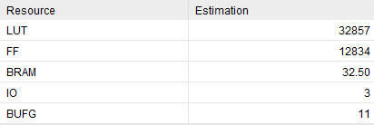

# Out-of-Order RISC-V Processor

A **1‑wide out‑of‑order (OoO) RISC‑V processor** implemented in **SystemVerilog** (UCLA **ECE‑189**, honors session of ECE‑M116C / CS‑M151B).  
Designed for **simulation in Vivado XSim** and **synthesizable RTL** workflows.

---

## Results

### Synthesis Resource Report

---

## Processor Design

---

## Architecture Overview

### Frontend: ICache → Fetch → Decode
- **I‑Cache (BRAM):** supplies instructions to **Fetch**.
- **Skid buffers:** elastic buffer for each stage.
- **Decode:** produces a compact instruction bundle for rename and future stages.

### Rename + Tracking: Map Table / Free List
- **Rename** maps architectural registers → physical registers using the **Map Table** and allocates new physical destinations from a **Free List**.

### Dispatch + Scheduling: RS_ALU / RS_LSU / RS_Branch / ROB
- **Dispatch** places renamed operations into specialized reservation stations:
  - `RS_ALU` for arithmetic / logical instructions
  - `RS_LSU` for memory instructions
  - `RS_Branch` for control‑flow instructions
- **ROB** tracks all in‑flight instructions to guarantee **precise architectural state** and **in‑order commit**.

### Execute + Memory System: ALU / Branch / LSU / LSQ / Main Memory / PRF
- **ALU** executes arithmetic / logical operations and writes back to PRF.
- **Branch unit** resolves control flow and triggers on mispredict/hit.
- Memory operations flow through **LSU + LSQ** into **BRAM main memory**, coordinating load/store ordering while still allowing OoO scheduling.
- The **PRF** holds the true operand values. Execution units read operands from PRF and write results back.

### Control‑Flow Recovery: Checkpoint + Flush/Redirect
- A **checkpoint mechanism** captures a snap shot of free list, map table, and PRF when a control-flow instruction is detected.
- On mispredict, the design flushes all data in each skid buffer and younger in‑flight instructions in ROB, LSQ, and RS. And then, restoring correct map table, free list, and PRF to maintain precise state.

---

## Supported RISC‑V Instructions (tested subset)

### Arithmetic / Logical
- I‑Type: `ADDI`, `ORI`, `SLTIU`
- R‑Type: `SRA`, `SUB`, `AND`

### Loads / Stores
- Loads (I‑Type): `LBU`, `LW`
- Stores (S‑Type): `SH`, `SW`

### Control Flow
- Branch (B‑Type): `BNE`
- Jump (I‑Type): `JALR`

### Upper Immediate
- U‑Type: `LUI`

---
